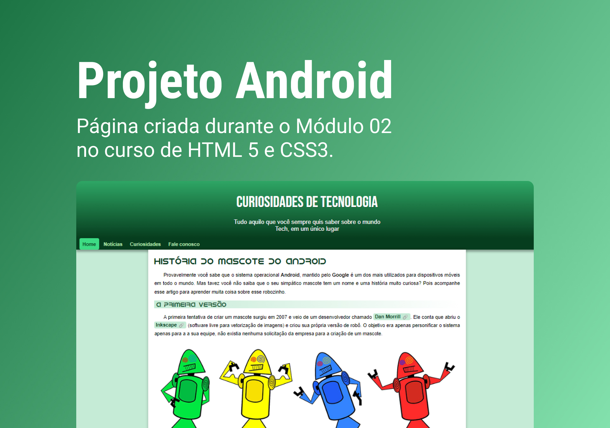

<h1 align="center"> Projeto Android </h1>

Projeto desenvolvido no curso HTML5 e CSS3 do CursoemVideo.  
<a href="https://www.youtube.com/watch?v=vPNIAJ9B4hg&list=PLHz_AreHm4dlUpEXkY1AyVLQGcpSgVF8s">Estude esse projeto em formato de vídeo clicando aqui.</a>

  <a href="#-tecnologias">Tecnologias</a>&nbsp;&nbsp;&nbsp;|&nbsp;&nbsp;&nbsp;
  <a href="#-projeto">Projeto</a>&nbsp;&nbsp;&nbsp;|&nbsp;&nbsp;&nbsp;
  <a href="#-layout">Aprendizado</a>&nbsp;&nbsp;&nbsp;|&nbsp;&nbsp;&nbsp;
  <a href="#memo-licença">Licença</a>

  

 

  

## 🚀 Tecnologias

Esse projeto foi desenvolvido com as seguintes tecnologias:

- HTML e CSS
- Git e Github
- Figma

## 💻 Projeto

O Projeto Android é uma página contando a história do desenvolvimento do mascote da marca.

- [Acesse o projeto finalizado, online](https://camillamorais.github.io/projeto-android/)

## 📖 Aprendizado

- No CSS3: Características aplicadas no tipo, classes, váriaveis, seletores e modelos de caixas.
- No HTM5: Listas, criação de wireframe, tipos, modulação de imagens e vídeos, responsividade em diversas telas (desktop e mobile).

## :memo: Licença

Esse projeto está sob a licença MIT.

---